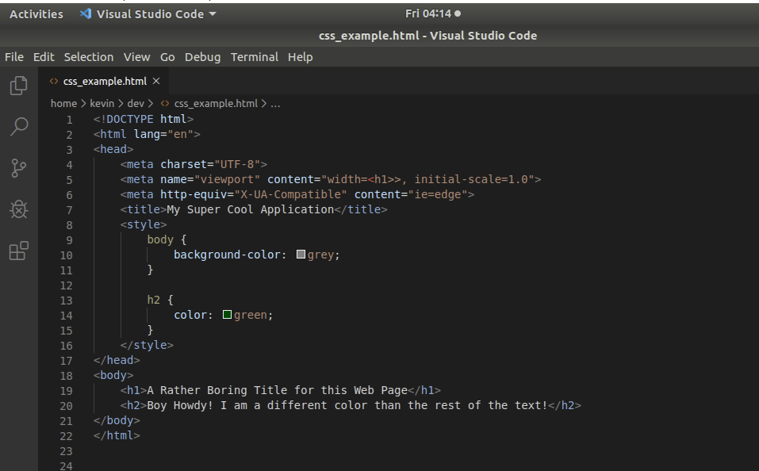
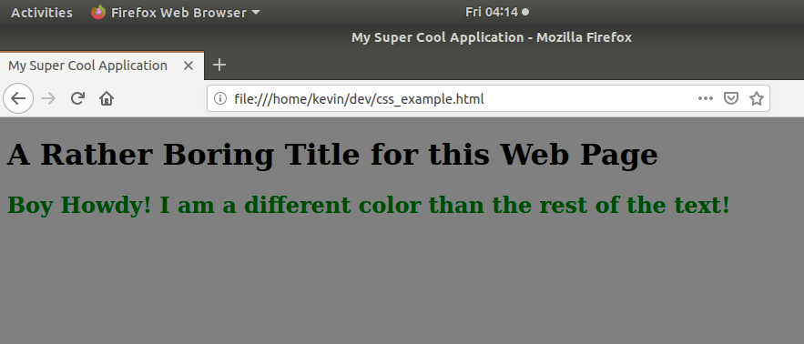
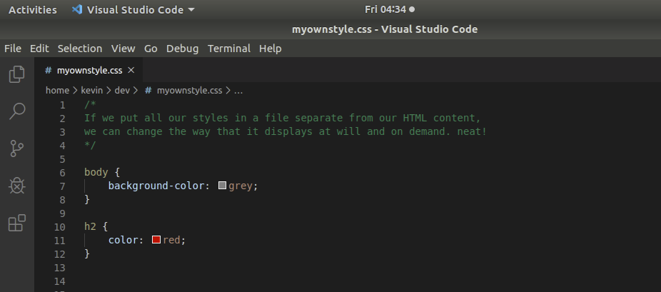
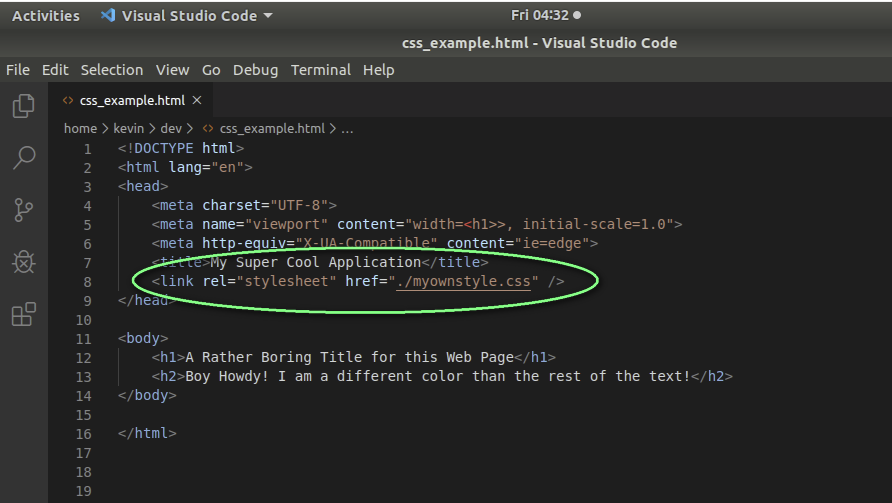
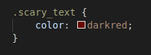
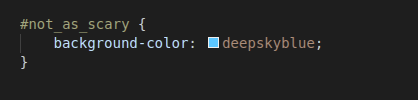
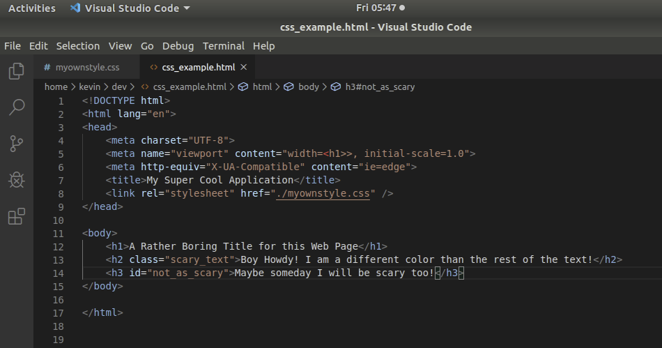
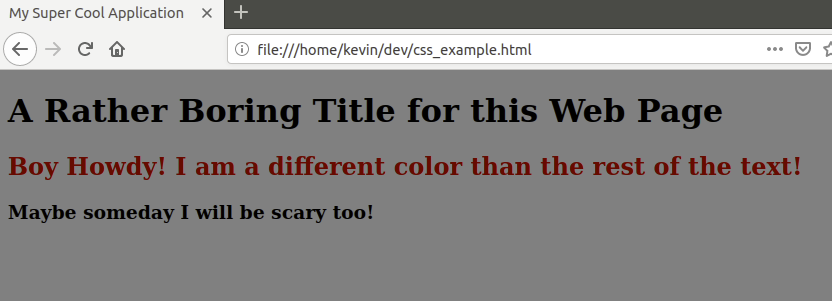
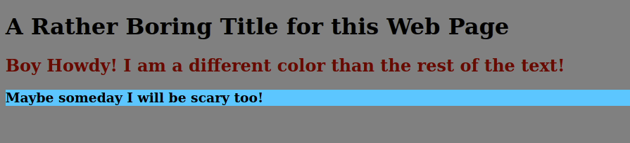

# Introduction to CSS

Cascading Style Sheets, or [CSS](https://en.wikipedia.org/wiki/Cascading_Style_Sheets), is a style sheet language used for describing the presentation of a document written in a markup language like HTML. CSS is a cornerstone technology of the World Wide Web, alongside [HTML and JavaScript](https://github.com/Kevin-CodeCrew/coding_concepts_sprint_2/blob/master/Introduction_to_HTML.md#html-concepts).

While technically you can style your HTML *inline* using the `style` attribute, in actual practice you should **always** separate the content (HTML) and the styling that will determine how it appears in the browser. By doing so you can easily change the look and feel of your entire web site on the fly simply by using a different style sheet file.

If you have ever selected a *theme* for your operating system, web browser, or other program then you understand the power of external styling of content.

## Using CSS in your own HTML Pages
So how do we *apply* a stylesheet to the HTML or application produces? By using the `style` HTML element. HTML supports the `style` element in order for you to include styling information in the HTML generated by your application. You can use [CSS](https://www.w3.org/Style/CSS/learning.en.html) in 2 different ways.

### Inline Styling with CSS
You can specify your styling *inline*. The word *inline* just means that you literally type the setting inside of an HTML element. 

`<h1 style="color:blue;">This is a Blue Heading</h1>`

This is a **VERY BAD** idea. As you can imagine, any time you want to change how the element is displayed in the web browser, you would have to manually go and find every reference (which may be in several HTML pages) and make the change. Instead, using CSS is the way to go.

Using CSS, you can specify all of your styling for your web site in a single place. However, HTML also allows CSS to be declared *inline* with a slightly different syntax. Simply change the style *in one place* and it takes affect on any and all web pages that include the CSS.

If styling via *inline* `<style>` elements, you always want to declare the styles in the *HEAD* portion of the HTML so that the styling information (colors, backgrounds, etc.) are already loaded and available before the web browser renders the *BODY* of the HTML.





While this is convenient, it is **A BAD IDEA** because then you are cursing your HTML content to always look the same because you are [hard coding](https://en.wikipedia.org/wiki/Hard_coding) what the web page will look like which makes it very difficult to maintain/keep current. 

### External Styling with CSS
The best option is to put all of your styling in a separate CSS file that then can be pulled in or *included* in all the HTML web content for your site. 





Now you can simply change one CSS file and change the look and feel of your **entire site** without touching a single line of our HTML!

### CSS Syntax
CSS definitions consist of 2 things:
1. Selector - The selector is the match pattern that determines for which HTML elements the style definition will take affect.
1. Properties/Values - There are many ways you can change the appearance of elements using CSS. You do so by specifying the characteristic or *property* of the content you wish to change, along with the new values. Like setting the text color to blue.

#### CSS Properties/Values
The [CSS](https://www.w3.org/Style/CSS/learning.en.html) specification defines several CSS properties for HTML elements. Your web browser will default to displaying elements a certain way, but as a software developer you can *override* (replace) the default definitions and change any CSS property that is valid for a given element. 

CSS uses object definitions similar to JavaScript object literals, in that you define name/value pairs within brackets. 

For each 
## Working With CSS Selectors
So then how do we specify exactly which HTML elements we want to change the color for or similar? We *select* them by specifying a matching selector/matching pattern in our CSS file. These are called *[CSS selectors](https://en.wikipedia.org/wiki/Cascading_Style_Sheets#Selector)*.

### Type Selectors
*Type* selectors are the broadest form for selecting multiple HTML elements, and are the least used. Type selectors select **all** HTML elements of a specified type, and applies the corresponding style(s) from your style sheet in CSS. For type selectors, you simply specify the name of the HTML element(s) without the brackets.

For example, the selector below will select **all** `H2` elements in the HTML document and will change the color of the text to red.

```
h2 {
    color: red;
}
```
### Class Selectors
*Class* selectors allow you to group many HTML elements and reference them all by their class name [attribute](./Introduction_to_HTML.md#attributes). You can optionally specify a class as an attribute to any HTML element(s).

 

> **NOTE** that there is no `.` in front of the class name in your HTML element

To specify a class selector in your CSS file(s) you do so by preceeding the class name with a `.` (period/dot).


> **NOTE** that there **IS** a `.` in front of the class name in your CSS

The selector names can be anything you wish, but you should always use meaningful names that make it clear which elements will be affected.

### ID Selectors
Each HTML element may be assigned an optional [ID](./Introduction_to_HTML.md#attributes). This ID value **must** be unique in the rendered HTML document. ID attributes are used when you want to *specifically target a single HTML element*. The selector in the CSS is specified by a hashtag (#) and the ID name.



Then in your HTML content



Once the CSS is applied/included to/in your HTML your page goes from this...



to this!



The ID/selector names can be anything you wish, but you should always use meaningful names that make it clear which element will be affected. As a best practice we will use the [BEM]() naming convention.

## CSS Positioning
The position CSS property sets how an element is positioned in a document. The top, right, bottom, and left properties determine the final location of positioned elements.

### Types of Positioning
- A *positioned* element is an element whose computed position value is either `relative`, `absolute`, `fixed`, or `sticky`. (In other words, it's anything except static.)
```
position: static;
```
- A *relatively* positioned element is an element whose computed position value is relative. The top and bottom properties specify the vertical offset from its normal position; the left and right properties specify the horizontal offset.
```
position: relative;
top: 40px; left: 40px;
```
- An *absolutely* positioned element is an element whose computed position value is absolute or fixed. The top, right, bottom, and left properties specify offsets from the edges of the element's containing block. (The containing block is the ancestor relative to which the element is positioned.) If the element has margins, they are added to the offset. The element establishes a new block formatting context (BFC) for its contents.
```
position: absolute;
top: 40px; left: 40px;
```
- A *stickily* positioned element is an element whose computed position value is sticky. It's treated as relatively positioned until its containing block crosses a specified threshold (such as setting top to value other than auto) within its flow root (or the container it scrolls within), at which point it is treated as "stuck" until meeting the opposite edge of its containing block.
```
position: -webkit-sticky;
position: sticky;
top: 20px;
```
#### float and clear
The `float` CSS property places an element on the left or right side of its container, allowing text and inline elements to wrap around it. The element is removed from the normal flow of the page, though still remaining a part of the flow (in contrast to absolute positioning).

The `clear` CSS property sets whether an element must be moved below (cleared) floating elements that precede it. The clear property applies to floating and non-floating elements.

## BEM Naming in CSS
the **B**lock, **E**lement, **M**odifier methodology (commonly referred to as [BEM](https://css-tricks.com/bem-101)) is a popular naming convention for classes in HTML and CSS. Developed by the team at Yandex, its goal is to help developers better understand the relationship between the HTML and CSS in a given project.

# Practice
- [CSS Selectors](https://github.com/cs-fullstack-master/css-intro-selectors-box-ic)
- [CSS Selectors and Box Model](https://github.com/cs-fullstack-master/css-intro-selectors-box-cw)
- [CSS Selector Practice Game - CSS Diner](https://flukeout.github.io/)
- [CSS Positioning 1](https://github.com/cs-fullstack-master/html-position_type-ic)
- [CSS Positioning 2](https://github.com/cs-fullstack-master/html-position_type-cw)
- [CSS Positioning 3](https://github.com/cs-fullstack-master/html-position_type_updated-cw)

# Additional Information
- [CSS BEM](https://css-tricks.com/bem-101/)
- [CSS Basics](https://developer.mozilla.org/en-US/docs/Learn/Getting_started_with_the_web/CSS_basics)
- [CSS Styling Text](https://developer.mozilla.org/en-US/docs/Learn/CSS/Styling_text)
- [MDN CSS Position Property](https://developer.mozilla.org/en-US/docs/Web/CSS/position)
- [CSS Positioning Video](https://www.youtube.com/watch?v=-vo0HzNHL3U)
- [CSS 'Display' Property Video](https://www.youtube.com/watch?v=FeIok3YFvFg)


