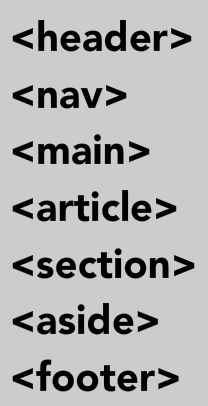

# Introduction to HTML
HTML (**H**yper**t**ext **M**arkup **L**anguage) is the code that is used to structure a web page and its content. For example, content could be structured within a set of paragraphs, a list of bulleted points, or using images and data tables. As the title suggests, this article will give you a basic understanding of HTML and its functions.

## HTML Concepts
HTML is not a programming language; it is a [markup language](https://en.wikipedia.org/wiki/Markup_language) that defines the structure of your content. HTML consists of a series of elements, which you use to enclose, or wrap, different parts of the content to make it appear a certain way, or act a certain way. The enclosing tags can make a word or image hyperlink to somewhere else, can italicize words, can make the font bigger or smaller, and so on. For example, take the following line of content:

`My cat is kind of a punk`

If we wanted the line to stand by itself, we could specify that it is a paragraph by enclosing it in paragraph tags:

`<p>My cat is kind of a punk</p>`

As far as it's relationship to the other key technologies such as [CSS](https://en.wikipedia.org/wiki/Cascading_Style_Sheets) and [JavaScript](https://en.wikipedia.org/wiki/JavaScript), [HTML](https://en.wikipedia.org/wiki/HTML), it is often described as 1 of 3 in *the triad* of core web development technologies (HTML, CSS, JavaScript).

It is often useful to think about the 3 complimenting technologies as a noun-adjective-verb relationship.

* The **Noun** HTML - HTML is the what, such as a paragraph
* The **Adjective** CSS - CSS defines the characteristics about the HTML content such as is **bold**
* The **Verb** JavaScript - JavaScript defines actions about the HTML such as 'hide this paragraph' or 'show' the form when the user clicks a button

### Elements


Generally in HTML, we markup content with tags that include a starting tag and an ending tag. All tags are in less/greater than signs/characters. The opening tag does not contain a slash while the ending tag does. That's how the browser knows where the markup starts and ends. Take for instance, the following paragraph. 

`<p>This is a song about nothing. This is a song about nothing at all. #POWERMAN5000</p>`

> NOTE the start and end of the markup.

The idea is that we **markup** the data to display. The browser will apply default formatting, but as a developer we have *complete control* and thus can override any default display characteristics.

The start/and stop elements just tell the browser where to start and end the formatting.

#### Self Closing Elements
There are a handful of elements that **only** have a start tag and no formal end tag. This is a legacy issue in that early versions of HTML really wasn't thinking that we would every programmatically retrieve and parse random web content (think Google) thus the [creators of HTML](https://en.wikipedia.org/wiki/Tim_Berners-Lee) really didn't consider how the data would be constructed such that it was easy to process. 

When [XML](https://en.wikipedia.org/wiki/XML) appeared, and consequently [XHTML](https://en.wikipedia.org/wiki/XHTML), it enforced much stronger rules about matching tags in markup content in that **every** tag should have a closing tag or a self-closing tag if a traditional single tag markup element. Create a *self-closing* tag simply by adding a `/` before the close of the initial element.

Example of valid but not best practice single HTML element

``

then a proper self-closing tab (note slash before end bracket)

``

### Attributes
Attributes are optional values you can specify with an HTML element. Depending on the element, some are required, but most are used to tweak how the element is handled. Setting image width and/or height a good example.

Attributes are always specified in the **begining** tag and not as part of the element content or closing tag.

``

The 2 most common attributes that apply to all HTML elements is *id* and *class*. These extra attributes are attached to allow you to style specific elements and/or allow you to determine which element fired a particular event so you can handle correctly in your code 

### HTML Document Structure
The main structure of HTML documents hasn't changed drastically over the years, but with the introduction of HTML5 semantic elements were introduced. 

Let's start with the primary sections of `<html>`, `<head>`, and `<body>` as well as declarations.

#### Declarations
In the development world, **declarations** are extra information that is provided so that processing entities can better predict the type of data they are dealing with. This includes programs like web browsers.

Every HTML document should start with a declaration that specifies which version of HTML it conforms to as well as any additional [metadata](https://en.wikipedia.org/wiki/Metadata) that assists in processing of the document. While technically they are not required, it is a best practice to use them.

As of HTML5 you can get by with a simple declaration if your HTMl is up to spec.

`<!DOCTYPE html>`

#### HEAD
The `head` portion of an HTML document is loaded first and contains items that will not be displayed within the browser window. There are many elements that only can appear in the `head` portion such as `<title>` which is used to specify the text that will show at the top of the window/tab when the page is displayed.

An example of an element that may or may not be in the HEAD section is the `<script>` tag used for specifying JavaScript. The `<script>` tag can appear anywhere in your HTML. If your JavaScript is not manipulating elements in the [DOM](https://en.wikipedia.org/wiki/Document_Object_Model) then you should specify/include it in the HEAD portion of your HTML. However if your JavaScript depends on specific elements in the DOM, make sure your JavaScript is specified/included **after** the markup for the elements that it interacts with. This is because until those elements are rendered, they are not accessible. The DOM will be covered in more detail in subsequent modules.

#### BODY
Any content that you want rendered in the browser should appear in the BODY section of your HTML. Any valid HTML element can appear in this section, however only content that generates output that can be *rendered* in the browser will be displayed.

Within the `BODY` you will have several types of other elements used to build your  page.

### HTML5 Semantics
With the release of HTML version 5, several semantic HTML elements were added. These [semantic](https://en.wikipedia.org/wiki/Semantics) elements were added just to provide more meaning to HTML content. They generally do not produce output, but instead are more of a way to mark off specific sections of your web pages so that they can be more consistently and easily styled using [CSS](https://github.com/Kevin-CodeCrew/coding_concepts_sprint_2/blob/master/Introduction_to_CSS.md#introduction-to-css). Using semantic HTML elements also makes your web pages more accessible for users that rely on screen readers or similar assisting technologies.

That explicit information also helps robots/crawlers like Google and Bing to better understand which content is important, which is subsidiary, which is for navigation, and so on. By adding semantic HTML tags to your pages, you provide additional information that helps Google and Bing understand the roles and relative importance of the different parts of your page and adds greatly to **S**earch **E**ngine **O**ptimization ([SEO](https://en.wikipedia.org/wiki/Search_engine_optimization)) so that users can more easily find your web site.



Think about it as a way to chop up your web pages. Prior to building any web page in HTML, take a moment to consider what the semantics should be for your web page. It will make your life so much easier when it comes to tailoring the look and feel of your websites with [CSS](./Introduction_to_CSS.md).


## The Importance of Comments

One of the most important things you can do for yourself, and your teammates, is comment your code. Comments in your code will not only help developers whomay have to enhance your code later,but can also help you to remember what your code is doing if you haven't been in the code for some time.

When your code executes, comments are ignored and not executed like other instructions because they are specified in a special format. 

```
<html>
<!-- Post Component -->
<article>

    <!-- Header Element of Post Component -->
    <header>
        <h1>First Week at Code School</h1>
    </header>

    <!-- Content Element of Blog Post Component -->
    <section>
        We learned a lot! I'm nervous that I won't be able to do it, but the instructors keep telling me that I will do fine.
    </section>

    <!-- Footer Element of Blog Post Component -->
    <footer>
    By Joe Student &copy; 2018
    </footer>
</article>

<!-- Sidebar Component -->
<aside class="sidebar">
    <!-- Header Element of Blog Post Component -->
    <header>
        <h2>Promoted Articles</h2>
    </header>

    <!-- List Element of Blog Post Component -->
    <ul>
        <li>First Week at Code school</li>
        <li>Starting Code School Soon</li>
        <li>I Got Accepted at Code School</li>
        <li>Thinking of Attending a Bootcamp</li>
    </ul>
</aside>
```
## HTML Forms
Forms allow us to get data input from Users to feed to our web applications. Users can fille out our form and submit the data to the server for processing.

### Form Element
The HTML <form> element defines a form that is used to collect user input:

```
<form>
.
  form elements
.
</form>
```

### The `<input>` Element
The `<input>` element is the most important form element. Users enter data via `input` elements.

The `<input>` element can be displayed in several ways, depending on the type attribute. The `type` attribute also can be used
 perform some action, validation and/or formatting for you depending on the type. For example, type `password` input element will hide the characters that the User types in.

Here are some examples:

`<input type="text">`	Defines a one-line text input field
`<input type="radio">`	Defines a radio button (for selecting one of many choices)
`<input type="submit">`	Defines a submit button (for submitting the form)


You will learn a lot more about input types later in this class.

### HTML Input Types
There are the many different input types you can use in HTML:

```
<input type="button">
<input type="checkbox">
<input type="color">
<input type="date">
<input type="datetime-local">
<input type="email">
<input type="file">
<input type="hidden">
<input type="image">
<input type="month">
<input type="number">
<input type="password">
<input type="radio">
<input type="range">
<input type="reset">
<input type="search">
<input type="submit">
<input type="tel">
<input type="text">
<input type="time">
<input type="url">
<input type="week">
```

#### Example
```
<form>
  User name:<br/>
  <input type="text" name="username"><br>
  User password:<br/>
  <input type="password" name="psw">
</form>
```

# Practice
* [Basics 1](https://github.com/cs-fullstack-master/html-basics1-ic)
* [Basics 2](https://github.com/cs-fullstack-master/html-basics1-cw)

# Additional Information
1. [Building Your First Web Page](https://learn.shayhowe.com/html-css/building-your-first-web-page/)
1. [Anatomy of an HTML document](https://developer.mozilla.org/en-US/docs/Learn/HTML/Introduction_to_HTML/Getting_started#Anatomy_of_an_HTML_document)
1. [Why you need structure](https://developer.mozilla.org/en-US/docs/Learn/HTML/Introduction_to_HTML/HTML_text_fundamentals#Why_do_we_need_structure)
1. [Anatomy of an HTML element](https://developer.mozilla.org/en-US/docs/Learn/HTML/Introduction_to_HTML/Getting_started#Anatomy_of_an_HTML_element)
1. [Example of the code](https://github.com/mdn/learning-area/blob/master/html/introduction-to-html/html-text-formatting/text-start.html)
1. [What the code looks like when run in a browser](http://htmlpreview.github.io/?https://github.com/mdn/learning-area/blob/master/html/introduction-to-html/html-text-formatting/text-start.html)
1. [The definitions behind all the new HTML5 tags](https://developer.mozilla.org/en-US/docs/Learn/HTML/Introduction_to_HTML/Document_and_website_structure)
1. [Anatomy of an attribute](https://developer.mozilla.org/en-US/docs/Learn/HTML/Introduction_to_HTML/Getting_started#Attributes)
